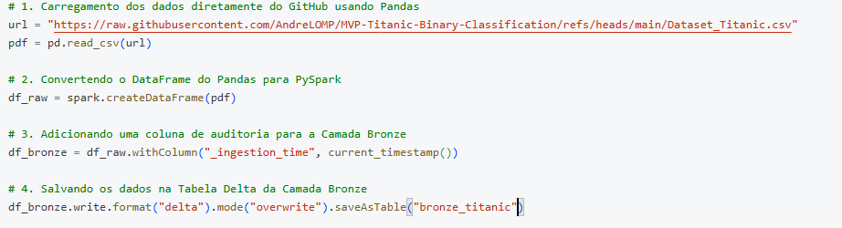
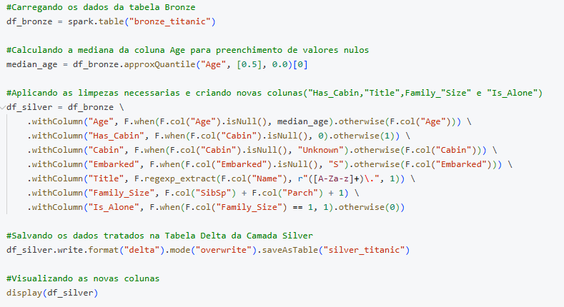
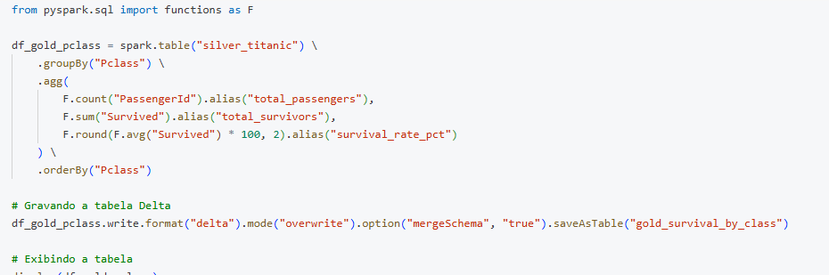
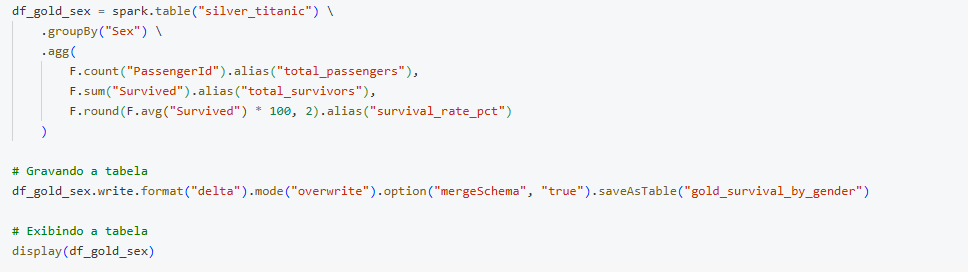
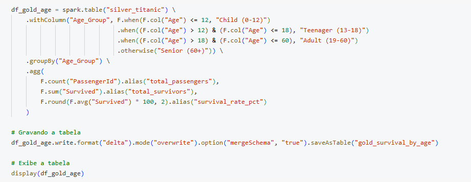
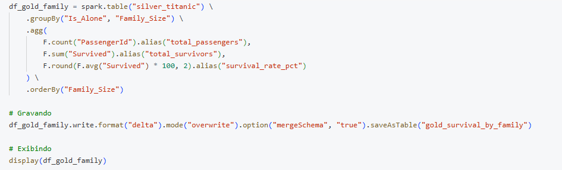
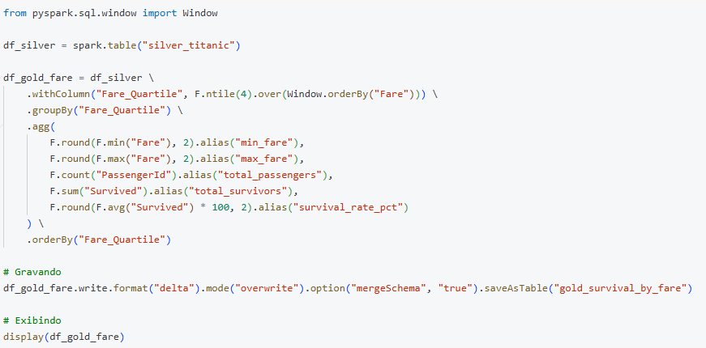

# MVP Engenharia de Dados - Análise de Sobrevivência do Titanic

#### Introdução
Neste MVP são explorados os dados do histórico de passageiros do fatídico desastre do **RMS Titanic**. O projeto foi construído utilizando a plataforma **Databricks** e a linguagem **PySpark**, aplicando os conceitos de Engenharia de Dados modernizados pela **Arquitetura Medalhão** e modelagem dimensional em **Star Schema**.

A análise desses dados busca entender os fatores socioeconômicos e demográficos que influenciaram diretamente nas chances de sobrevivência dos passageiros durante o naufrágio.

---

#### Objetivo
O objetivo deste trabalho é processar, limpar, modelar e analisar o conjunto de dados do Titanic, transformando dados brutos em visões analíticas de negócio prontas para consumo e entender quais fatores mais influenciaram na sobrevivencia dos passageiros.

Para responder às dúvidas centrais sobre o desastre, foram estabelecidas **5 hipóteses/perguntas de negócio**:

1. **Os passageiros de primeira classe sobreviveram mais do que os passageiros de outras classes?**
2. **A porcentagem de sobrevivência das mulheres foi maior do que a dos homens?**
3. **A idade foi um fator determinante na sobrevivência?**
4. **A presença de familiares a bordo (irmãos/cônjuges e pais/filhos) facilitou ou dificultou o processo de sobrevivência?**
5. **A tarifa (`Fare`) paga pelo passageiro influenciou diretamente na sua sobrevivência?**

---

#### Detalhamento

##### Busca e Coleta de Dados
A base primária utilizada foi o arquivo `Dataset_Titanic.csv`, disponivel no site https://www.kaggle.com/datasets/yasserh/titanic-dataset. Esse dataset contem 891 registros de passageiros e 12 colunas originais (`PassengerId`, `Survived`, `Pclass`, `Name`, `Sex`, `Age`, `SibSp`, `Parch`, `Ticket`, `Fare`, `Cabin` e `Embarked`). 

O arquivo foi ingerido no ambiente do Databricks via PySpark a partir de repositório remoto, garantindo persistência e processamento distribuído nativo.

##### Modelagem
A modelagem seguiu rigorosamente a **Arquitetura Medalhão**:

* **Camada Bronze:** Ingestão do CSV bruto para a tabela Delta `bronze_titanic`, preservando o esquema original e adicionando a coluna de auditoria `_ingestion_time`.

  

* **Camada Silver:** Tabela Delta `silver_titanic` com tratamento de nulos (`Age`, `Cabin`, `Embarked`) e criação de novas variáveis (*feature engineering*): `Has_Cabin`, `Title`, `Family_Size` e `Is_Alone`.

  

* **Camada Gold (Curated & Dimensional):** Estruturação do modelo dimensional em **Star Schema** e geração das tabelas agregadas para consumo em BI:
  * **Tabela Fato:** `gold_fact_passenger_survival` (contém métricas e chaves estrangeiras).
  * **Tabelas Dimensão:** `gold_dim_passenger`, `gold_dim_pclass` e `gold_dim_embarked`.
  * **Tabelas Agregadas de Negócio:** `gold_survival_by_class`, `gold_survival_by_gender`, `gold_survival_by_age`, `gold_survival_by_family` e `gold_survival_by_fare`.

##### Dicionário de Metadados (Tabela Silver)
| Coluna | Tipo | Descrição / Transformação |
| :--- | :--- | :--- |
| `PassengerId` | Integer | Identificador único do passageiro (Chave Primária) |
| `Survived` | Integer | Indicador de sobrevivência (0 = Não, 1 = Sim) |
| `Pclass` | Integer | Classe do bilhete (1 = 1ª, 2 = 2ª, 3 = 3ª Classe) |
| `Name` | String | Nome completo do passageiro |
| `Sex` | String | Gênero do passageiro (`male` / `female`) |
| `Age` | Double | Idade em anos (Imputada mediana nos nulos) |
| `SibSp` | Integer | Número de irmãos/cônjuges a bordo |
| `Parch` | Integer | Número de pais/filhos a bordo |
| `Ticket` | String | Número do bilhete |
| `Fare` | Double | Tarifa paga pela passagem |
| `Cabin` | String | Número da cabine (Preenchido `"Unknown"` nos nulos) |
| `Embarked` | String | Porto de embarque (`S` = Southampton, `C` = Cherbourg, `Q` = Queenstown) |
| `Has_Cabin` | Integer | Flag binária indicando se possuía cabine registrada (`1` ou `0`) |
| `Title` | String | Título social extraído do nome (`Mr`, `Mrs`, `Miss`, `Master`, etc.) |
| `Family_Size` | Integer | Tamanho total da família a bordo (`SibSp + Parch + 1`) |
| `Is_Alone` | Integer | Flag binária indicando se viajava desacompanhado (`1` se `Family_Size == 1`) |

---

#### Carga e Pipeline

A subida e o processamento dos dados na nuvem foram realizados inteiramente dentro do **Databricks**, utilizando **PySpark** e o formato de armazenamento **Delta Lake** para garantir transações ACID.

##### O que foi feito em cada camada:
1. **Ingestão Bronze:** O arquivo CSV foi convertido em um dataframe PySpark e a tabela foi gravada como `bronze_titanic`.
2. **Transformação Silver:** Tratamento de valores ausentes em `Age` (imputação por mediana), `Cabin` e `Embarked`, extração de recursos (*Title*, *Family_Size*, *Is_Alone*) e gravação da tabela `silver_titanic`.
3. **Modelagem Gold:** Construção do modelo dimensional **Star Schema** (`fact` + `dims`) e geração de visões agregadas para responder às 5 perguntas de negócio com o comando `display()`.

---

#### Análise

##### Qualidade dos Dados e Tratamentos
* **`Age`:** Apresentava valores nulos no dataset original. Foram preenchidos utilizando a mediana das idades para não distorcer a distribuição.
* **`Cabin`:** Apresentava elevada taxa de valores ausentes. Os nulos foram substituídos por `"Unknown"` e criou-se a flag `Has_Cabin` para indicar passageiros com cabine declarada.
* **`Embarked`:** Valores ausentes foram preenchidos com o porto mais frequente (`'S'` - Southampton).
* **`Name`:** Foi extraído o título social (`Title`) via expressão regular (`r"([A-Za-z]+)\."`) para identificar classes sociais e faixas etárias específicas (ex: `Master` para meninos).
* **`SibSp` e `Parch`:** Unificados na métrica de tamanho de família (`Family_Size`) para melhor interpretação sociológica.

##### Solução do Problema / Resposta às Perguntas de Negócio

* **1. Os passageiros de primeira classe sobreviveram mais do que os de outras classes?**
  
  

  

  * **Análise:** **Sim.** A classe social teve impacto direto na sobrevivência. A **1ª Classe** obteve uma taxa de sobrevivência de **62,96%** (136 de 216), a **2ª Classe** obteve **47,28%** (87 de 184) e a **3ª Classe** registrou a menor taxa, com apenas **24,24%** (119 de 491).

* **2. A porcentagem de sobrevivência das mulheres foi maior do que a dos homens?**

  

  

  * **Análise:** **Sim.** O gênero foi a variável de maior peso. Das 314 mulheres a bordo, **233 sobreviveram (74,20%)**. Em contrapartida, dos 577 homens, apenas **109 sobreviveram (18,89%)**, refletindo a política de evacuação "mulheres e crianças primeiro".

* **3. A idade foi um fator determinante?**

  

  

  * **Análise:** **Sim.** **Crianças (0-12 anos)** obtiveram a maior taxa de sobrevivência entre as faixas etárias (**57,97%** - 40 de 69). **Adolescentes (13-18 anos)** registraram **42,86%** (30 de 70), **Adultos (19-60 anos)** registraram **36,58%** (267 de 730), enquanto **Idosos (60+ anos)** tiveram a menor taxa (**22,73%** - 5 de 22, isso reforça ainda mais a hipótese de que os mais jovens foram evacuados primeiro junto com as mulheres.

* **4. A presença de familiares facilitou ou dificultou a sobrevivência?**

  

  

  * **Análise:** **Pequenas famílias tiveram taxa de sobrevivência mais alta, pessoas viajando sozinhas tiveram taxa de sobrevivência baixa e famílias grandes sofreram prejuízos**. Passageiros em famílias de **2 a 4 pessoas** apresentaram taxas de sobrevivência elevadas (entre **55,28%** e **72,41%**). Passageiros **sozinhos (`Is_Alone = 1`)** tiveram **30,35%** de sobrevivência (163 de 537). Já grupos familiares com **5 ou mais membros** tiveram taxas reduzidas (famílias de 5 pessoas tiveram **20,00%**, famílias de 6 pessoas tiveram **13,64%**, e famílias com 8 ou 11 membros registraram **0%** de sobrevivência, isso indica que pessoas sozinhas e com muitos familiares possivelmente tiveram dificuldades no desembarque, enquanto grupos de até 4 pessoas tiveram mais facilidade.

* **5. A tarifa (`Fare`) paga influenciou diretamente na sobrevivência?**

  

  

  * **Análise:** **Sim.** Ao dividir os bilhetes em quartis de tarifa:
    * **1º Quartil (tarifa min 0 - max 7.9):** **19,73%** de sobrevivência (44 de 223).
    * **2º Quartil (tarifa min 7.93 - max 14.45):** **30,04%** de sobrevivência (67 de 223).
    * **3º Quartil (tarifa min 14.45 - max 31.00):** **45,74%** de sobrevivência (102 de 223).
    * **4º Quartil (tarifa min 31.28 - max 512.33):** **58,11%** de sobrevivência (129 de 222).
    Isso mostra que sim! a tarifa foi um fator determinante para a sobrevivencia, ainda indicando que as pessoes que pagaram mais tiveram a taxa de sobrevivencia mais alta.

---

#### Conclusão (Principais Achados)
A análise dos dados na camada Gold revelou padrões sociais e econômicos marcantes que definiram as chances de sobrevivência no naufrágio do Titanic:

1. **Gênero como Variável Predominante:** O sexo do passageiro foi o fator de maior impacto isolado. As mulheres registraram **74,20%** de sobrevivência contra apenas **18,89%** dos homens, comprovando o cumprimento rigoroso da diretriz militar de salvamento "mulheres e crianças primeiro".
2. **Priorização Hierárquica por Idade:** Crianças (0-12 anos) obtiveram a maior taxa de sobrevivência entre as faixas etárias (**57,97%**), enquanto idosos acima de 60 anos tiveram o menor índice (**22,73%**), demonstrando que a vulnerabilidade etária foi considerada no acesso aos botes.
3. **Disparidade Socioeconômica (Classe e Tarifa):** A posição social e o poder aquisitivo ditaram o acesso aos recursos de emergência. Passageiros da **1ª classe (62,96%)** e do **4º quartil de tarifa (58,11%)** sobreviveram em proporções significativamente superiores aos passageiros da **3ª classe (24,24%)** e do **1º quartil de tarifa (19,73%)**.
4. **Impacto do Tamanho Familiar:** Grupos familiares reduzidos (2 a 4 pessoas) obtiveram os melhores índices de sobrevivência (até **72,41%**), beneficiando-se da cooperação mútua sem perder a agilidade. Por outro lado, viajantes solitários (**30,35%**) e famílias muito numerosas (**0%** para 8 ou 11 membros) enfrentaram os piores cenários de evacuação.

#### Autoavaliação
O objetivo principal de construir um pipeline de Engenharia de Dados completo no Databricks utilizando PySpark e responder a todas as perguntas de negócio foi atingido com sucesso.

A implementação da **Arquitetura Medalhão** permitiu manter a rastreabilidade desde o dado bruto na camada *Bronze*, passando pela limpeza na *Silver*, até a estruturação de um Star Schema na camada *Gold*.

Entre as principais dificuldades superadas, destacam-se a adequação do acesso ao sistema de arquivos no Databricks (evitando erros de permissão em caminhos locais), a escolha adequada das técnicas de imputação de nulos para a coluna `Age` e a aplicação correta do comando `display()` para renderização imediata das tabelas agregadas.

Para trabalhos futuros, almeja-se implementar a orquestração automatizada desse pipeline via **Databricks Workflows (Jobs)** e a conexão direta do modelo Star Schema ao **Power BI** para disponibilização de dashboards interativos em tempo real.
